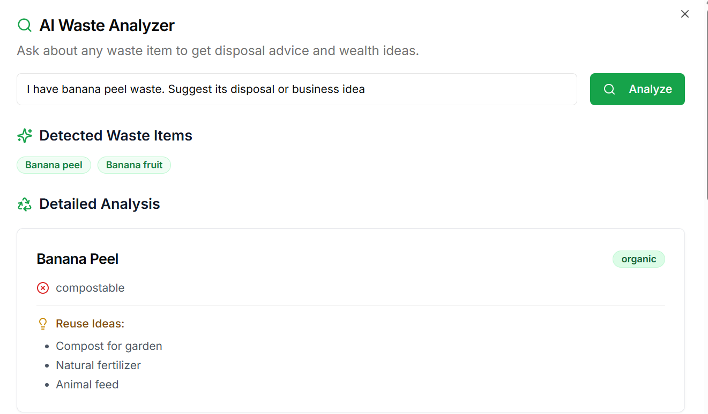
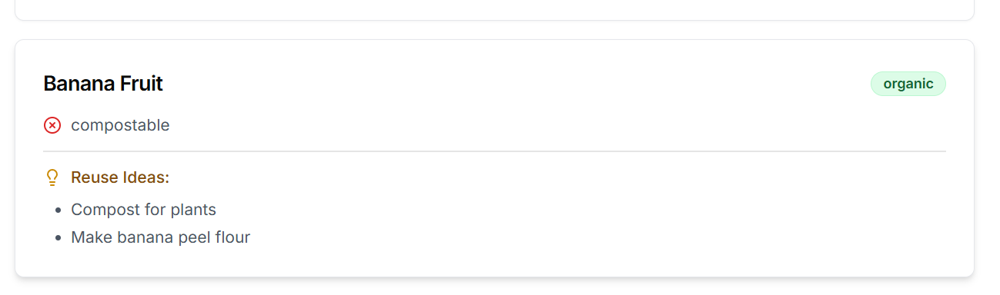
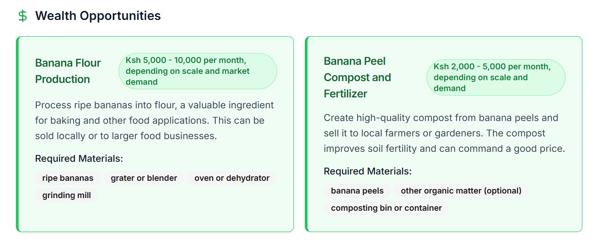

- Sample screenshots from the AI-Driven waste management and recycling system are attached as:





## Prompt Engineering Workflow

This project was built through an iterative **prompt-first development approach** where each component—from backend to frontend—was designed by giving precise instructions to an LLM.

Below is a detailed, chronological breakdown of **real prompts used** to generate the entire platform. These prompts demonstrate clarity of intent, architectural foresight, and rapid prototyping.

---

### PHASE 1: Backend Foundation (LangGraph + Gemini + Firecrawl)

#### Setup Waste Analysis Workflow with LangGraph

**Prompt:**

> “Build a LangGraph workflow powered by Gemini and Firecrawl to do the following in 3 steps:
>
> 1. Search and extract up to 5 specific waste items from content related to a user query.
> 2. Analyze each item to provide category, recyclability, health risks, and reuse ideas.
> 3. Generate 2–3 wealth creation project ideas based on analyzed items.
>    Return a `WasteQueryState` model containing all data.”

#### Add General Question Shortcut

**Prompt:**

> “In the run method, detect short general questions like ‘What is waste?’ or ‘How to recycle plastic?’ using keywords like ‘what’, ‘how’, ‘why’, etc., or word count <= 6.
> For such cases, return a quick answer using Gemini without running the full LangGraph pipeline.”

#### Add Pydantic Models for Workflow

**Prompt:**

> “Define three Pydantic models:
>
> 1. `WasteItemInfo` with fields `name`, `category`, `recyclability`, `health_risk`, `reuse_ideas`.
> 2. `WealthIdea` with `title`, `description`, `required_materials`, `estimated_value`.
> 3. `WasteQueryState` with query, extracted_waste_items, items_info, wealth_ideas, quick_answer.”

#### Firecrawl + Gemini Integration

**Prompt:**

> “In `_extract_items_step`, use Firecrawl to search for articles related to the query, scrape them, then prompt Gemini to extract specific waste items from the content.
> Extract maximum of 5 waste items listed one per line.”

---

### PHASE 2: Token Optimization and Output Control

#### Limit Waste Extraction to One Item

**Prompt:**

> “To reduce token usage, limit extracted waste items to **only one most relevant** item based on the query context. Trim content if necessary and prioritize item that directly answers the query.”

#### Improve Wealth Idea Output Format

**Prompt:**

> “Gemini cannot return List\[T] directly. Wrap the `List[WealthIdea]` in a new class `WealthIdeasResponse` with field `ideas: List[WealthIdea]`.
> Use this wrapper as the output schema when calling `with_structured_output`.”

#### Trim Wealth Ideas to Two

**Prompt:**

> “In `_generate_ideas_step`, return **only the top 2 most relevant** wealth-to-income project ideas based on the waste item. Make sure the ideas are sorted by relevance and impact.”

#### Fix Gemini JSON Output

**Prompt:**

> “Ensure Gemini returns structured JSON format matching `WealthIdea` model:
> Include title, description, required_materials (list), and optional estimated_value.
> Wrap in valid JSON list and remove unnecessary explanations.”

---

### PHASE 3: Frontend UI with TypeScript + Supabase

#### Mobile-First React App with API Integration

**Prompt:**

> “Build a mobile-first React app using TypeScript.
> Fetch response from a FastAPI backend that returns `extracted_waste_items`, `items_info`, and `wealth_ideas`.
> Display them in collapsible sections or animated cards. Ensure responsive layout and smooth scroll.”

#### Supabase Authentication Setup

**Prompt:**

> “Add Supabase email/password authentication with secure session handling.
> Include registration, login, logout, and real-time auth state management using Supabase client.
> Store tokens securely and show/hide content based on auth state.”

#### Add Dancing Smart Bin Loader

**Prompt:**

> “Create a loading screen with a dancing smart bin that bounces, rotates, and sparkles using Framer Motion.
> Show this animation when the app is analyzing a query or waiting for a response.”

#### API Error Handling

**Prompt:**

> “Implement graceful error handling on frontend when the API call fails or returns invalid data.
> Show a fallback error card and retry option. Ensure UI doesn’t crash.”

---

### BONUS: UX & Aesthetic Prompts

#### Enhance Result Presentation

**Prompt:**

> “Render `items_info` and `wealth_ideas` using animated, colorful cards.
> Color-code recyclability (e.g., green for recyclable, red for non-recyclable).
> Animate entry with staggered slide-in effect using Framer Motion.”

#### Add Fallback Data for Dev

**Prompt:**

> “Add mock JSON responses for `items_info` and `wealth_ideas` in case backend is unavailable.
> Toggle between mock and live data using a development flag.”

## Local Development Setup

Follow these steps to run both the backend and frontend locally:

---

### 1. Clone the Repository

```bash
git clone https://github.com/your-username/RecycloHub.git
cd RecycloHub
```

---

### 2. Backend Setup (FastAPI + Gemini + Firecrawl)

#### Step into the backend folder:

```bash
cd server
```

#### Create and activate a virtual environment:

```bash
# Windows
python -m venv .venv
.venv\Scripts\activate

# macOS/Linux
python3 -m venv .venv
source .venv/bin/activate
```

#### Install dependencies:

```bash
pip install -r requirements.txt
```

#### Create a `.env` file:

Create a `.env` file in the `server/` directory and add the following:

```env
GOOGLE_API_KEY=your_gemini_api_key
FIRECRAWL_API_KEY=your_firecrawl_api_key
```

> ⚠️ Replace the values with your actual API keys.

#### Run the FastAPI server:

```bash
uvicorn app.main:app --reload
```

The backend will run at `http://localhost:8000`

---

### 3. Frontend Setup (React + Supabase)

#### Step into the frontend folder:

```bash
cd ../client
```

#### Install frontend dependencies:

```bash
npm install
```

#### Configure Supabase and backend API:

Create a `.env.local` file in the `client/` folder:

```env
VITE_SUPABASE_URL=https://your-project-id.supabase.co
VITE_SUPABASE_ANON_KEY=your-anon-key
VITE_BACKEND_API_URL=http://localhost:8000/api/analyze
```

> ⚠️ Replace the Supabase URL and key with your actual credentials from the Supabase dashboard.

#### Run the frontend dev server:

```bash
npm run dev
```

The frontend will run at `http://localhost:5173`

---

### 4. Test the Full App

1. Go to `http://localhost:5173`
2. Register or log in using Supabase authentication
3. Enter a waste-related query like:
   **"I have banana peels and old electronics at home"**
4. Wait for the dancing smart bin animation while the AI processes your request
5. View the extracted items, recyclability, and creative income ideas

---

### 🛠️ Troubleshooting Tips

- Ensure both `client` and `server` folders have their respective `.env` files.
- Confirm Gemini and Firecrawl API keys are correct.
- If CORS issues occur, check FastAPI CORS middleware settings in `main.py`.
- Use mock data toggle on frontend during offline development.

## Security and Fault Tolerance

RecycloHub prioritizes data protection, responsible AI usage, and resilience against unexpected failures through the following practices:

### Security Measures

- **Supabase Authentication**
  Secure and modern user authentication using Supabase with support for email/password login and protected user sessions.

- **Environment Variables**
  Sensitive API keys (e.g., Gemini, Firecrawl, Supabase) are stored securely in `.env` files and never exposed to the frontend or committed to version control.

- **Backend API Protection**
  FastAPI backend is structured to validate and sanitize all incoming queries, reducing injection and malformed input risks.

- **Structured Output with Validation**
  AI-generated outputs are parsed against strict Pydantic schemas (`WasteItemInfo`, `WealthIdea`, `WasteQueryState`) to prevent malformed or malicious data from being returned to users.

---

### Fault Tolerance Strategies

- **Graceful Error Handling**
  Try-except blocks around all LLM and Firecrawl calls ensure the app doesn't crash on failure. Instead, it falls back with default messages or empty states.

- **Partial Response Recovery**
  Even if some steps fail (e.g., analyzing one waste item), others continue. The pipeline returns all successful data and logs failures for debugging.

- **Development Fallbacks**
  Frontend includes mock data toggles to allow testing without a live backend or API keys, ensuring smooth prototyping.

- **Retry and Logging Support**
  LangGraph's built-in `arun_with_retry` logic handles retryable tasks for LLMs to reduce timeout or transient errors.

---

### AI Workflow Architecture

RecycloHub leverages a structured, AI-first architecture to intelligently handle user queries using LangGraph, Gemini, and Firecrawl. The workflow is designed to be efficient, fault-tolerant, and cost-effective.

#### Workflow Flowchart

```
User Query
   └──> Is it a general question?
            ├── Yes → Answer directly with Gemini → Done
            └── No → Begin structured pipeline:
                    ├── Step 1: Firecrawl retrieves and scrapes relevant articles
                    ├── Step 2: Gemini extracts specific waste items
                    ├── Step 3: Gemini analyzes each waste item (category, risks, recyclability)
                    └── Step 4: Gemini generates 2 targeted waste-to-wealth ideas
```

#### Core Technologies

- **LangGraph:** Manages the multi-step stateful workflow with async support
- **Google Gemini (via LangChain):** Handles all structured language tasks
- **Firecrawl:** Fetches and scrapes real-time web content for contextual AI reasoning
- **Pydantic Models:** Enforce schema validation on all AI outputs
- **Async/Await:** Optimized for performance and concurrency across all I/O operations

The workflow ensures each component is isolated, testable, and fault-resilient—making the system highly maintainable and production-ready.

---

### Test Queries & Expected Output

Use the sample queries below to explore RecycloHub's full capabilities. These examples demonstrate both the general Q\&A flow and the full AI analysis pipeline.

#### General Q\&A (Quick Answer)

Ask concise questions that require a definition, explanation, or procedure:

- `What is e-waste?`
- `How do I recycle used batteries?`
- `Why is waste segregation important?`
- `Who is responsible for waste management in Kenya?`

**Output:**
A direct, expert response from Gemini with 1–2 paragraph explanation.

---

#### Full AI Analysis & Wealth Ideas

Ask contextual or descriptive questions that include a waste type or scenario:

- `There are many banana peels in my kitchen. What should I do with them?`
- `I have a pile of scrap metal at home. Can I turn it into something useful?`
- `There’s used cooking oil in my restaurant. How can I reuse or sell it?`
- `My compound is full of tyre wastes. Are they recyclable?`

**Output Includes:**

- Extracted waste item(s) from content
- Detailed analysis per item:

  - Type (organic, electronic, plastic)
  - Recyclability and health risks
  - Practical reuse ideas

- Top 2 relevant waste-to-wealth ideas with materials and earning potential
